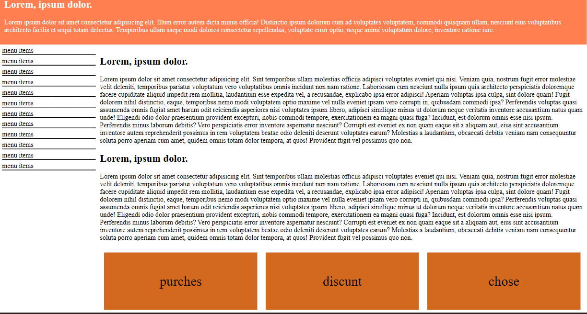
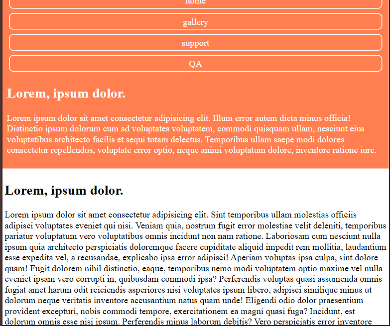

# Respansive

[](https://github.com/sajjad-sisakhtpour/respansive)
[](https://github.com/sajjad-sisakhtpour/respansive)
[](https://github.com/sajjad-sisakhtpour/respansive/issues)

## Overview

**Respansive** is a responsive web design project aimed at providing a dynamic user experience across various screen sizes. It uses HTML, CSS, and responsive design techniques to ensure the website looks good on both desktop and mobile devices.

This project is part of a portfolio to showcase my skills in front-end development, particularly focusing on responsive design.

## Prerequisites

Before you begin, ensure you have met the following requirements:

- A modern web browser (e.g., Chrome, Firefox, Edge)
- Basic understanding of HTML, CSS, and responsive design principles

## Installation

Follow these steps to set up the project on your local machine:

1. Clone the repository:

   ```bash
   git clone https://github.com/sajjad-sisakhtpour/respansive.git
   ```

2. Navigate to the project directory:

   ```bash
   cd respansive
   ```

3. Open `index.html` in your preferred browser to view the project locally.

## Usage

Once the project is set up, you can view the responsive layout by resizing your browser window or viewing it on different devices.

- **Desktop View**: Displays the full navigation and content in a two-column layout.
- **Mobile View**: Adjusts the layout to a single-column format, hides the menu, and stacks content vertically.

## Examples

Here are some examples of how the layout adapts to different screen sizes:

- On larger screens (desktops), the navigation and content are displayed side by side.
- On smaller screens (tablets and phones), the content reflows into a more vertical layout with simplified navigation.

## Documentation

For more information on responsive web design and best practices, you can refer to the following resources:

- [MDN Web Docs: Responsive Design](https://developer.mozilla.org/en-US/docs/Learn/CSS/CSS_layout/Responsive_Design)
- [CSS-Tricks: A Complete Guide to Flexbox](https://css-tricks.com/snippets/css/a-guide-to-flexbox/)

## Contributing

If you would like to contribute to this project, feel free to fork the repository, create a new branch, and submit a pull request. Contributions are always welcome!

1. Fork the repository.
2. Create a feature branch (`git checkout -b feature-branch`).
3. Commit your changes (`git commit -am 'Add new feature'`).
4. Push to the branch (`git push origin feature-branch`).
5. Create a new pull request.

## License

This project is licensed under the MIT License - see the [LICENSE](LICENSE) file for details.

## Contact

If you have any questions, feel free to reach out:

- Email: [sajjad.sisakhtpour@gmail.com](mailto:sajjad.sisakhtpour@gmail.com)
- GitHub: [https://github.com/sajjad-sisakhtpour](https://github.com/sajjad-sisakhtpour)
- LinkedIn: [https://ir.linkedin.com/in/sajad-sisakht-pour](https://ir.linkedin.com/in/sajad-sisakht-pour)

## Live Demo

You can view a live version of the project here: [Live Demo](http://your-live-demo-link.com)

## Screenshots

Here are some screenshots of the project in action:



